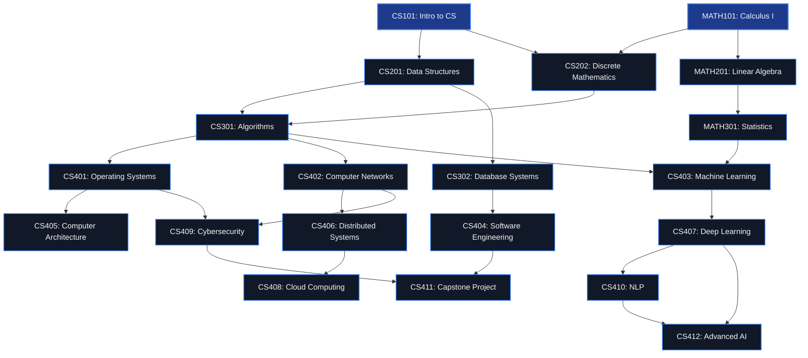

# CampusPath 🎓

CampusPath is a modern, interactive web application that serves as a beautiful educational playground illustrating two key computer science and systems programming concepts:

1. **Topological Sort (DFS-based)**: An algorithmic technique (using Directed Acyclic Graphs) to automatically calculate the optimal, dependency-aware semester-by-semester plan for a student based on course prerequisites and a credit-hour limit.
2. **Mutex Locks (`threading.Lock` / `std::mutex`)**: A systems programming concept demonstrating thread-safety. It illustrates how race conditions occur during concurrent seat registrations under heavy student loads and how mutual exclusion prevents data corruption and seat overbooking.

The application features a sleek, responsive dark-themed dashboard (with glassmorphism UI principles) alongside a C++ integration that compiles and runs concurrent simulations directly through the web interface.

---

## 🗺️ Visual Course Prerequisite DAG

Here is a visual map of the prerequisite tree defined in `courses.json`. All paths flow from left (introductory) to right (advanced).



---

## 🧠 Core Computer Science Concepts

### 1. Prerequisite Planning via Topological Sort (DFS)
* **Directed Acyclic Graph (DAG)**: Courses are represented as nodes, and prerequisite requirements as directed edges (e.g., `CS101 → CS201`).
* **Cycle Detection**: The system employs a **three-state Depth-First Search (DFS)** cycle detection algorithm (using state values for unvisited, visiting, and fully visited) to verify that course prerequisite structures do not contain deadlocks (infinite loops like `A → B → A`). If a cycle is ever introduced into `courses.json`, the app flags it and stops planners to prevent runtime lockups.
* **Topological Sort**: A DFS post-order traversal determines a valid ordering where every prerequisite comes before its target course.
* **Personalized Planner**: Takes a student's completed courses, identifies remaining courses, runs topological sorting, and groups them into semesters:
  * Restricts enrollment to a maximum of **12 credits per semester**.
  * Ensures that a course is scheduled only if *all* its prerequisites were completed in a previous semester or are in the user's completed history.

### 2. Multi-threaded Course Registration & Race Conditions
* **The Problem (Race Condition)**: When multiple students register for the same course simultaneously under heavy load, multiple execution threads retrieve the remaining seat count at the same instant. If 1 seat remains and 10 threads verify that a seat is available, all 10 might write their enrollment records, leading to an overbooked course (e.g., seat count drops to `-9`), corrupted indices, or lost database transactions.
* **The Solution (Mutex Lock)**:
  * **Python Application**: A mutual exclusion lock (`threading.Lock()`) enforces serial execution on the critical section. Only one student register worker can access the shared memory database state, read the seat counts, modify the counts, and persist the update back to `courses.json` at a time.
  * **C++ Systems Demo (`mutex_demo.cpp`)**: Demonstrates these exact mechanics at the low-level operating system thread layer. It launches 100 concurrent threads competing for 30 course seats. Under the **WITHOUT MUTEX** execution, race conditions cause severe data corruption, lost updates, or overbooking. Under the **WITH MUTEX** execution (`std::lock_guard<std::mutex>`), access is synchronized perfectly, ensuring exactly 30 students enroll and the remaining 70 are gracefully waitlisted.

---

## 📁 Repository Structure

```
CampusPath/
├── app.py                  # Core Flask server and endpoint routes
├── registration.py         # CourseGraph & CourseRegistration engine (DFS topological sort, python mutex)
├── mutex_demo.cpp          # C++ source file simulating OS-level multithreading with & without mutexes
├── courses.json            # Database storing available courses, prerequisites, credits, and seat allocations
├── debug_enroll_flow.sh    # Bash test script verifying student registration, login, and prerequisite verification
├── run_cpp.py              # Script utility compiling & executing the mutex_demo.cpp binary
├── server.log              # Logs of active HTTP traffic & Flask server diagnostics
├── requirements.txt        # Python dependency list
├── templates/              # HTML views (sleek, dark-themed responsive glassmorphic UI)
│   ├── login.html          # Secure student session authentication gate
│   ├── signup.html         # Register new student profile (in-memory persistent registry)
│   ├── dashboard.html      # Main panel featuring user progress stats, interactive unlocks, & academic planner
│   ├── courses.html        # Database directory illustrating availability, unlocked status, and enrollment actions
│   ├── cpp_demo.html       # Visual system terminal logging parallel C++ compiler & runtime output comparison
│   └── index.html          # Legacy sandbox demo panel (local sandbox)
└── venv/                   # Local python virtual environment
```

---

## ⚙️ Quick Start & Installation

### Prerequisites
1. **Python**: Version `3.8` or newer is recommended.
2. **C++ Compiler**: `g++` (GCC) with support for standard thread libraries (`C++17` standard) to execute the system-level threading demo.
   * *Mac Users*: Install Xcode Command Line Tools: `xcode-select --install`
   * *Linux Users*: `sudo apt install build-essential`

### Step-by-Step Setup

1. **Clone & Navigate to the Repository**
   ```bash
   cd CampusPath
   ```

2. **Initialize and Activate Virtual Environment**
   ```bash
   python3 -m venv venv
   source venv/bin/activate
   ```

3. **Install Dependencies**
   ```bash
   pip install -r requirements.txt
   ```

4. **Launch the Server**
   ```bash
   python app.py
   ```

5. **Interact in your Browser**
   Open your browser to: **[http://127.0.0.1:5000/](http://127.0.0.1:5000/)**

---

## 🔗 Endpoint Reference

| Path | Method | Auth Required | Description |
|---|---|---|---|
| `/` | `GET` | No | Root index. Redirects to `/login`. |
| `/login` | `GET`, `POST` | No | Renders login page and authenticates active student profiles. |
| `/signup` | `GET`, `POST` | No | Handles new student profile generation. Stores password & active profile records in memory. |
| `/logout` | `GET` | No | Destroys the current user session and returns to login gate. |
| `/dashboard` | `GET` | Yes | Renders the primary student portal. Displays stats (total/completed/remaining), personalized topological course plans grouped by semester, and dynamically unlocks next available actions. |
| `/courses` | `GET` | Yes | Renders list of all courses in `courses.json`. Displays metadata, seat limits, prerequisites, and a button to register for available classes. |
| `/enroll` | `POST` | Yes | Enrolls the logged-in student in a course. Inspects prerequisites, thread-safely locks seats using a mutex, decrements available seats, and outputs structural status. |
| `/status` | `GET` | Yes | API endpoint returning JSON detailing locked, completed, and missing prerequisite states for the current student. |
| `/complete` | `POST` | Yes | Marks an enrolled class as completed. This triggers structural unlocks on dependent courses, updates the database, and refreshes the student's dashboard plan. |
| `/cpp-demo` | `GET` | Yes | Triggers a compilation phase (`g++ -std=c++17 -pthread mutex_demo.cpp -o mutex_demo`) and executes the output binary in the background. It reads compilation/execution streams and outputs them side-by-side inside a simulated dark terminal dashboard. |

---

## 🧪 Verification & Testing Flow

The application comes bundled with a comprehensive verification test suite (`debug_enroll_flow.sh`) to assert correctness of authentication gates, dynamic path unlocking, and prerequisite checking.

To run the verification flow:

1. **Ensure the Flask app is running** on `http://127.0.0.1:5000`.
2. **Execute the test script** in another terminal:
   ```bash
   chmod +x debug_enroll_flow.sh
   ./debug_enroll_flow.sh
   ```

### What the test script verifies:
1. **Student Account Signup**: Registers a user `script@ex.com`.
2. **Session Authentication Logins**: Signs in and establishes cookie parameters.
3. **Prerequisite Checking (Locked Guard)**:
   * Registers for `CS101` (Intro to CS).
   * Completes `CS101` to unlock next courses.
   * Successfully registers for `CS201` (Data Structures) and `CS202` (Discrete Mathematics), which list `CS101` as their prerequisite.
4. **Data Verification**: Inspects final JSON state to ensure all progress registers correctly.
